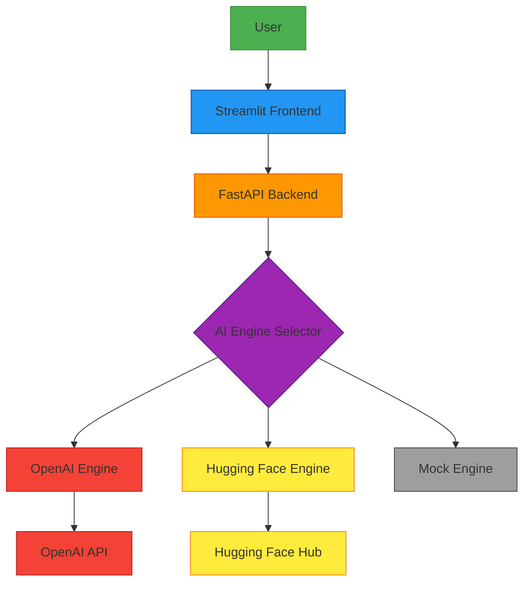

# Agentic AI Tutor Architecture

```mermaid
graph TB
    A[User] --> B[Streamlit Frontend]
    B --> C[FastAPI Backend]
    C --> D{AI Engine Selector}
    D --> E[OpenAI Engine]
    D --> F[Hugging Face Engine]
    D --> G[Mock Engine]
    
    E --> H[OpenAI API]
    F --> I[Hugging Face Hub]
    
    style A fill:#4CAF50,stroke:#388E3C
    style B fill:#2196F3,stroke:#0D47A1
    style C fill:#FF9800,stroke:#E65100
    style D fill:#9C27B0,stroke:#4A148C
    style E fill:#F44336,stroke:#B71C1C
    style F fill:#FFEB3B,stroke:#F57F17
    style G fill:#9E9E9E,stroke:#424242
    style H fill:#F44336,stroke:#B71C1C
    style I fill:#FFEB3B,stroke:#F57F17
```